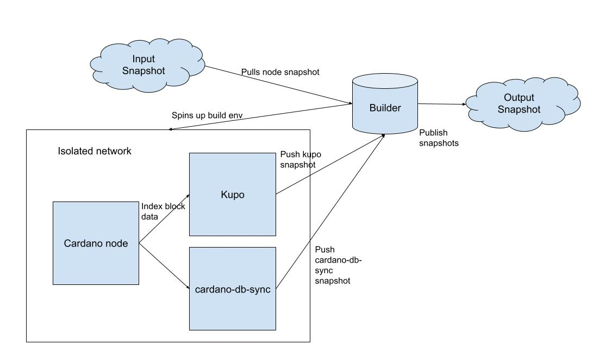

# Cardanow

The goal of this project is to reduce the friction Cardano developers encounter when trying to provision or maintain the necessary infrastructure for a DApp. 

The first step in this direction is to provide a caching service for three key components in almost any DApp: the cardano node, cardano-db-sync and kupo.

> Although here we use the term cache for consistency with the original proposal, it is more illuminating to think of this service as a snapshot provider. The goal of this service is to produce and host snapshots that users can fetch to spin up an environment rapidly. In the remaining of this document we will stick with the term snapshot provider.

We also produced [a video](https://www.youtube.com/watch?v=xuwEbPUlZ-s) that contains an introduction and a high-level description of this architecture.

## Architecture

The goal of this system is to build snapshots for the three components listed above, and then upload them to some location where they will be retrievable by end users.

Using one of these snapshots to initialise the node - or one of the indexers - is significantly faster than letting it sync up the state of the ledger from scratch. [This](https://www.youtube.com/watch?v=5qjJNRgEzYo) video by the Mithril team shows the difference in speed between spinning up a node from scratch, vs using one of the Mithril snapshots.

We can almost view this as a CI project, where we have to regularly build some artifact (the snapshot), and push it to some service where users can consume it (usually a registry, or some cloud storage).

As a goal, we want to make these builds as deterministic as possible, so each user always has the option to run this service themself and verify the authenticity of each snapshot.

As a starting point, we need to produce, or obtain, some trustable snapshots of the state of the cardano-node.
The [Mithril Network][1] has recently been established with this very goal, and currently produces several snapshots of the node db per epoch, across different networks (mainnet, preprod and preview).

We can focus our attention on one single network from now on: and assume that we will be running an instance of this system for each network we need to cover.

The following diagram shows the different components involved in producing these snapshots.

We will have a component called `Builder`, which represents some machine that will periodically be spun up to run this build

At the end of each epoch, we can fetch the latest snapshot for that epoch through the Mithril network. This will be the state of the cardano-node that all of our other snapshots will be based on.

We will now provision a cardano-node using the snapshot, this node and all the indexers will be provisioned on a network with no outbound access, this means components have no connection to the internet, thus the node can not receive any other blocks than the ones in the mithril snapshot.

Once the node is ready, we can spin up instances of each indexer we want to build a snapshot for. These components will all connect to the same cardano-node.

Once this is done will have snapshots of the databases for all the supported indexers, alongside the snapshot of the cardano-node we fetched from the Mithril network.

All the generated snapshots can finally be uploaded back to our snapshot storage servers. To be able to fully identify each snapshot, we have to keep around some metadata about how it was generated. In particular, for each indexer snapshot, we will record:

- cardano-node version
- cardano-node snapshot
- indexer version

This information will be stored in the filename, for example: assuming we produced a snapshot with `kupo v2.8.0` from a `cardano node v2.3.0` with the snapshot from `2023-10-10`, then the output would be called `snapshot-kupo-2.8.0-2023-10-10-2.3.0.tar`.

We also have to account for the fact of periodically having to update versions of the node and indexers. Sometimes this will also mean that snapshots that were produced with an earlier version of the indexer, will not work with a later version of it.
We will attempt to always use the latest (major) cardano-node version to build the snapshots and - for each indexer - the latest (major) version supporting the node we are running.

One consideration to make is that using a snapshot, provided by a third party, partly invalidates many of the benefits of using a distributed ledger. This is because you ultimately have to trust the party that is producing these snapshots, to not alter the data in any way.
To mitigate this issue, we will publish the hash of each snapshot. Users will be able to easily spin up our system locally, and re-compute the snapshots if and when they want to verify the authenticity of the data contained inside of it. Moreover, all the code will be open source, so members of the community will be able to read exactly what code is involved in producing the snapshots.

### Hosting the snapshots

It is important to pick a reliable system for the snapshots to be hosted, this could be something like AWS S3, or a comparable product.
Any hosting solution for the snapshots will have to provide at least the following:

- Access control for the data. This means that the snapshots are exposed as read-only. There will be only one key that is authorised to write to the storage, this will be used by our system producing snapshots.

- Replication across different regions. We want to host the snapshots across different locations, to increase the speed at which they can be downloaded by users. New snapshots are only added once per epoch, which makes replication relatively easier, as updates are infrequent. Nevertheless, we want to ensure that any storage solution offers availability across different regions, and fast replication of the data between them

### Notes

- [This Architecture document](./docs/Caching%20Infrastructure%20Architecture%20Design.pdf) adds some details on how this system should be deployed to make it secure and isolate different parts from each other.

- The build script for each indexer will need a way to query the indexer and detect if it is done processing all the data from the node [example][2].

- Snapshots produced by cardano-db-sync are dependent on [the architecture][3]. We will initially only support `x86_64`.

- Rollbacks could happen across epoch boundaries. In this case, the node might contain data that has been rolled-back, and since the node is not connected to the internet, it won't be able to detect the rollback has happened. In this case, the indexer snapshots will also contain this rolled-back data. Luckily the indexers (and node) are built to deal with this possibility, so they should be able to replace the small portion of data that has been rolled-back, as soon as they detect it. Nevertheless, we want to build a test suite that specifically tests these scenarios to catch any unexpected behavior in the presence of rollbacks.

- We will always have, at minimum, 2 snapshots from the last 2 epochs. When a new snapshot is produced, we want to make sure to keep this invariant, only after the new snapshot is uploaded to the storage, we can mark for deletion the oldest one available. We also need to ensure that if an old snapshot is being downloaded as it gets marked for deletion, then users who are already downloading it, will be able to finish, but new queries should not list the snapshot as available.

## Using the snapshots

We can provide several ways of using the snapshots for the supported components.

- Cardano-node
- Kupo
- cardano-db-sync

We will provide tools to easily download snapshots for each service and start it with the snapshotted data.
Each component will provide a docker image that can be run to fetch the desired snapshot and then start off the service from there.
We will also provide a script to achieve the same without docker.

### Notes

- We can use `kupo copy` [4][4] to allow users to reduce their final DB. We will always export a copy of the DB that indexes *. Users can specify what kupo filters they want and we can restrict the DB to only those matches

- We can use  `postgresql-setup.sh --restore-snapshot` to restore snapshot on cardano-db-sync.

[1]: https://mithril.network/doc/
[2]: https://cardanosolutions.github.io/kupo/#operation/getHealth
[3]: https://github.com/input-output-hk/cardano-db-sync/blob/release/13.1.1.x/doc/state-snapshot.md#things-to-note
[4]: https://github.com/CardanoSolutions/kupo/blob/master/CHANGELOG.md#240---2023-02-23

## Testing
Integration testing consists on a testing suite that run based on an input parameter: the network. It is possible to spawn a local mithril network and use that to run.

Uploading is not yet supported in the testing suite.
